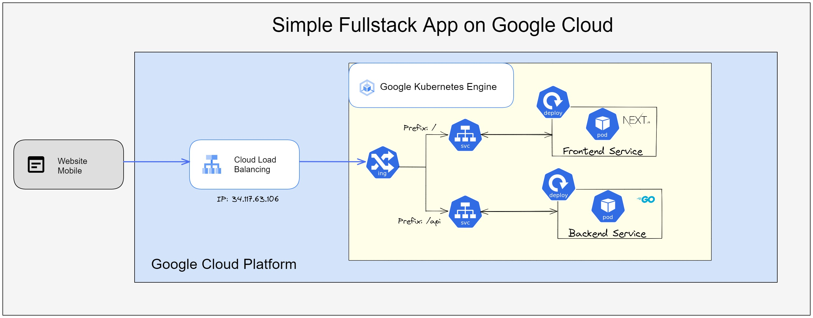
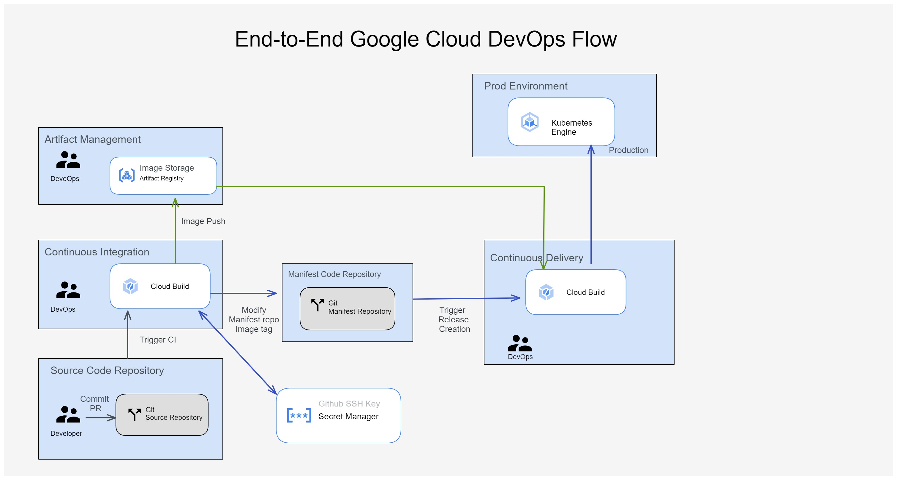

# Web-Infra-Template
## Usage
- A template for building a fullstack application on GKE *(Google K8s Engine)*.
- A template for Gitops-style CI/CD pipeline.
    - [Manifest repo](https://github.com/CyCTW/web-manifests)

## Architecture Diagram
### Fullstack App

### CI/CD Pipeline

## Total used GCP Resource 
- 1 [GKE cluster](https://cloud.google.com/kubernetes-engine)  with 2 nodes.
- 3 [Cloud build](https://cloud.google.com/build) pipeline.
    - 2 CI pipeline for frontend and backend service.
    - 1 CD pipeline for Manifest.
- 1 [Secret Manager](https://cloud.google.com/secret-manager?hl=zh-tw)
    - Store Github private ssh key.
- [Artifact Registry](https://cloud.google.com/artifact-registry)
    - Store frontend and backend's images.
- 1 [HTTPS(L7) Load Balancer](https://cloud.google.com/load-balancing/docs/https)
    - Configured by Ingress

## Total used k8s Resource
See [Manifest repo](https://github.com/CyCTW/web-manifests) to get detailed information.
- One [gce Ingress](https://cloud.google.com/kubernetes-engine/docs/concepts/ingress) 
    - Ingress controller
    - Paths
        - `/`: for frontend
        - `/api`: for backend
- Two Services
    - Frontend Service
    - Backend Service
- Two Deployments
    - Frontend Deployment with 1 Pod.
    - Backend Deployment with 1 Pod.

